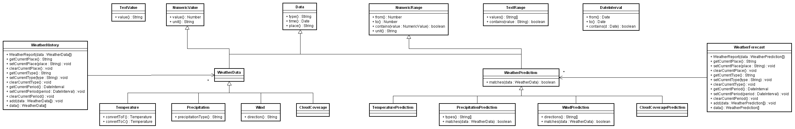

#Object-oriented

##Diagram

##Tasks

###1.1
Implement the diagram using factory methods. Do not use constructors or the class keyword. Encapsulate everything. Use concatenative inheritance to model the inheritance in the diagram, and also to remove as many redundancies as you can from the diagram.

###1.2
Implement the diagram using constructors and prototypes. Use the class keyword if you like. You are not required to encapsulate the fields. You need to redesign in order to deal with the multiple inheritance. Remove as many redundancies as you can.